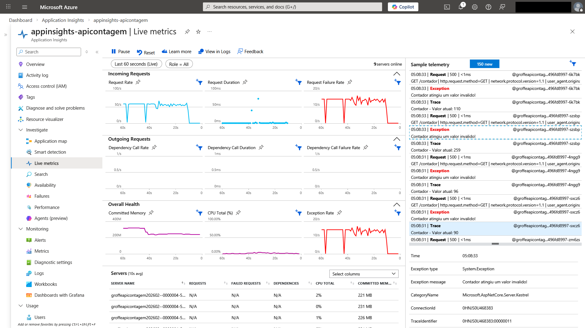

# aspnetcore10-minimalapis-appinsights-otel-scalar_contagemacessos-simulacaofalhas
Exemplo de API REST para contagem de acessos criada com .NET 10 + ASP.NET Core + Minimal APIs + Scalar. Inclui o monitoramento via Azure Application Insights + OpenTelemetry, além de um Dockerfile para a geração de imagens baseadas em Linux e um flag para simulação de falhas.

Imagem no Docker Hub: https://hub.docker.com/r/renatogroffe/aspnetcore10-apicontagem-simulacaofalhas/tags

Para baixar esta imagem execute o comando:

```bash
docker pull renatogroffe/aspnetcore10-apicontagem-simulacaofalhas:1
```

Monitoramento desta API REST via Application Insights + OpenTelemetry:



Pipeline do Azure DevOps empregado em testes de carga com esta API: https://github.com/renatogroffe/aspnetcore10-minimalapis-appinsights-otel-scalar_contagemacessos-simulacaofalhas

Workflow do GitHub Actions empregado em testes de carga com esta API: https://github.com/renatogroffe/k6-loadtests-githubactions-api-html-dashboard